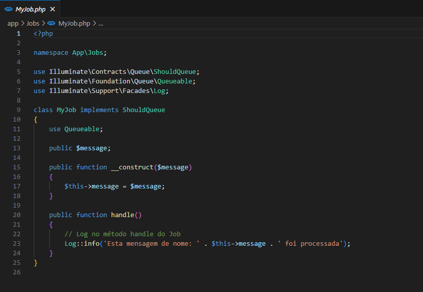
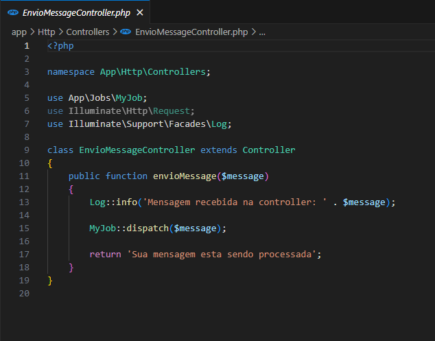
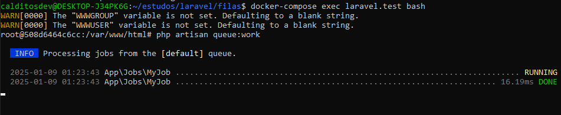
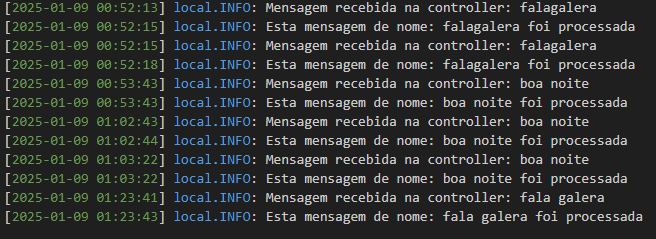

# Filas de mensagem

Breve descrição do seu projeto e o que ele faz.

## Tecnologias Utilizadas

- **Laravel 11.x**
- **SQLite** (ou o banco de dados utilizado)
- **Docker** (se aplicável)
- **Redis** (se usado)
- **Queue e Jobs** no Laravel

## Como Rodar o Projeto

### Pré-requisitos

- PHP 8.3
- Composer
- SQLite ou qualquer outro banco de dados configurado
- Docker (opcional)

### Instalação

1. Clone o repositório:

git clone https://github.com/seuusuario/filas-laravel.git

2. Instale as dependências do Composer:

composer install

3. Copie o arquivo .env.example para .env:

cp .env.example .env

4. No arquivo .env, configure o banco de dados para SQLite:

DB_CONNECTION=sqlite
DB_DATABASE=/path/to/database/database.sqlite

5. Crie o banco de dados:

touch database/database.sqlite

6. Execute as migrations:

php artisan migrate

7. Se estiver usando o Docker:

docker-compose up -d

